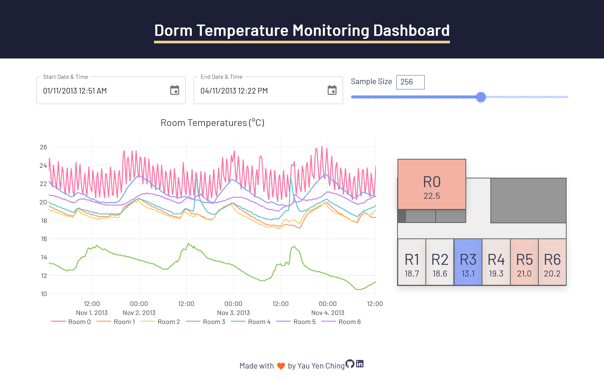
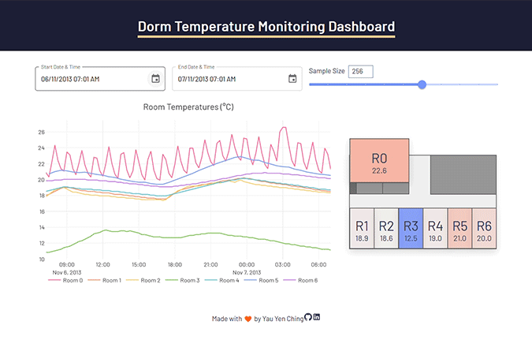
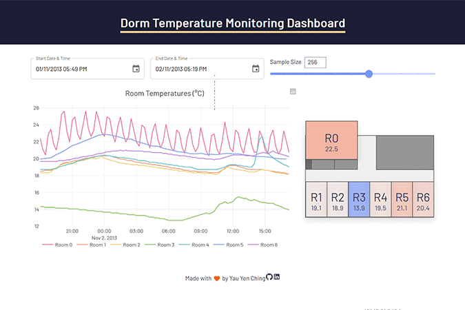

<h1 align="center">Dorm Temperature Monitoring Dashboard</h1>
<p align="center">
  
  
  
  
  
</p>
A full-stack web application with elements of Progressive Web Apps for a mock building smart temperature management system for a dormitory using TypeScript, React, Sass, and Meteor. This project as part of a final assignment for a UI development course.

## ✨ Preview ##
<div align="center" style="display:block;">
  <figure>
    
    <div><b>Explore and interact with time series data in a visually appealing format!</b></div>
  </figure>

  <h3>🔗 Check out the live bot on telegram (<a href="https://t.me/WordleScoreboardBot">@WordleScoreboardBot</a>)!</h3>
</div>

## ⭐ Features (with images) ##
### Responsive website design
<div align="center">
    
    <div>The UI dynamically adjusts to fit different form factors</div>
  </figure>
</div>

### Linkable
<div align="center" style="display:block;">
  
  <div>App's settings are stored in the URL for easy shareability</div>
</div>

### Adjust the time window
<div align="center" style="display:block;">
  
  <div>Adjust date time range using material-ui pickers</div>
  <br>

  
  <div>Zoom in/out of the plot using the mousewheel</div>
  <br>

  
  <div>Zoom into the plot using click + drag</div>
  <br>

  
  <div>Pan the plot using shift + click + drag</div>
</div>
  
### Adjust sample granularity
<div align="center" style="display:block;">
  
  <div>Adjust number of data points shown on the plot using a slider</div>
</div>

### Floor plan
<div align="center" style="display:block;">
  
  <div>Filter what data is shown on the plot using the floor plan</div>
  <br>

  
  <div>The floor plan changes color depending on the average temperature of the data in the date time range</div>
</div>


## 🛠️ Implementation ##
This project was bootstrapped using Meteor and coded using TypeScript and React hooks.

The server firsts parses the dataset (`private/room-temperatures.csv`) and inserts them into a Meteor collection i.e., a MongoDB database.

On the client's end, the client requests data from the server-side according to the input date time range. From then on, the client manipulates the data further by downsampling the data as necessary and aggregating the data by room id for futher calculations.

The client then presents the filtered data using a time series graph using [Plotly](https://plotly.com/javascript/react/)  and a floor plan. Both the time series and floor plan is interactive and users can adjust the input parameters (i.e., *date time range, sample granularity, visible rooms*) through these components.

## 🧰 Libraries ##
* [Material-UI](https://mui.com/)
* [janjakubnanista/downsample](https://github.com/janjakubnanista/downsample)

## ⚙️ Building this Project ##
If you are new to Meteor, install Meteor first by following this [quick start guide](https://guide.meteor.com/).

To deploy this application locally, first clone this repository and navigate to its directory. Then, in the terminal,

```
meteor npm install
```
to install all dependencies. Then,
```
meteor run
```
to run a local development build. The app will take a few minutes to intialize the data. Then, in the terminal, you will see
```
...
=> App running at: http://localhost:3000
```
Going to http://localhost:3000/ in your browser will then launch the app.

## 📂 File Structure
```
private/        ## Mock raw CSV room temperature data
server/         ## Server-side code for parsing and inserting the CSV data
client/         ## Container for the UI code and CSS styling
imports/
  api/          ## Business logic for handling room temperature data
  db/           ## Room temperature collection and custom types
  ui/           ## Presentation logic and UI components
  utils/        ## Convenience and auxiliary functions
```

## 📝 License ##
This project is licensed under the MIT License - see the [LICENSE](https://github.com/yauyenching/dorm-temp-dashboard/blob/main/LICENSE) file for details.
